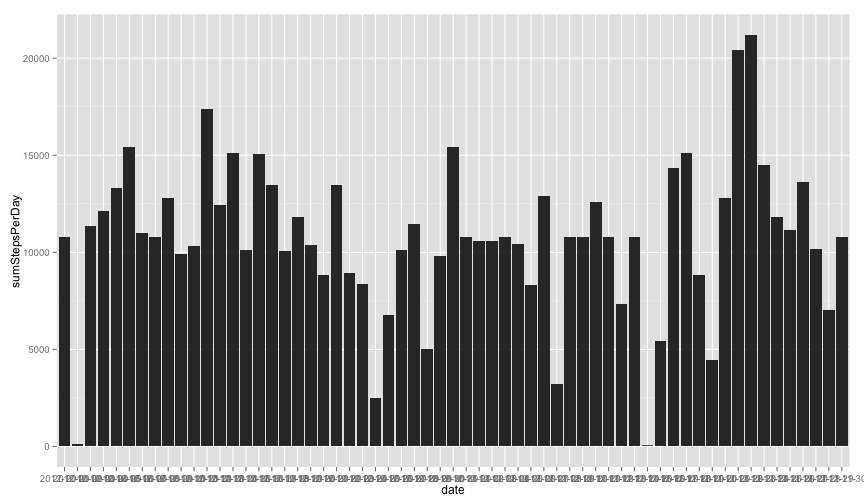

Reproducible Research 
==========================
# Peer Assessment 1

Make a R markdown file to show the process of data analysis on the personal movement data collected from monitoring devices.

## 1 Loadding and preprocessing the data

```r
# prepare the libraries we need
library(knitr)
library(ggplot2)

# load data
setwd("/Develop/R/Coursera/ReproResrch")
data = read.csv("activity.csv")
```

-------------


##  2  What is mean total number of steps taken per day

```r
# Get the sum of steps taken for each date and turn the reusslt to dataframe
sum.numofStepsPerDay <- tapply(data$step, data$date, sum, na.rm = TRUE)
sum.df = data.frame(date = names(sum.numofStepsPerDay), sumStepsPerDay = sum.numofStepsPerDay)
# Make Histgram using ggplot
ggplot(sum.df, aes(x = date, y = sumStepsPerDay)) + geom_histogram(binwidth = 0.5, 
    stat = "identity")
```

 


```r
# The mean and median total number if steps taken per day
mean.StepsPerDay = mean(sum.df$sumStepsPerDay)
median.StepsPerDay = median(sum.df$sumStepsPerDay)
```

### [ Answer ] : The mean is 9354.2295 and median is 10395 

-------------


##  3  What is the average daily activity pattern?

```r
# Get the average steps taken for each interval and turn the reusslt to
# dataframe
avg.avgStepsPerInterval <- tapply(data$step, data$interval, mean, na.rm = TRUE)
avg.df = data.frame(interval = names(avg.avgStepsPerInterval), avgSteps = avg.avgStepsPerInterval)
avg.df$interval = as.numeric(as.character(avg.df$interval))

# Time series plot of the average number of steps taken (averaged across all
# days) versus the 5-minute intervals
ggplot(avg.df, aes(x = interval, y = avgSteps)) + geom_line()
```

 

```r
# Find the interval with max avgSteps taken
maxAvgStepsPerInterval = avg.df[which.max(avg.df$avgSteps), ]$interval
```

### [ Answer ] : The interval with max value of steps accross all days : 835 

-------------


##  4 Imputing missing values
### 4.1 Total number of rows with NAs

```r
# Caculate the total number of rows with NAs
numOfNa = sum(is.na(data$steps))
```

### [ Answer ] : The total number of rows with NAs : 2304

## 4.2 Derive a Strategy to fill the NAs
### [ Answer ] : The strategy : Fill the NAs with average steps for that interval

```r
# 
data2 = data
for (i in 1:nrow(data2)) {
    # if steps is NA
    if (is.na(data2[i, ]$steps)) {
        # fill the NA with the avgSteps of that i
        tarInterval <- data2[i, ]$interval  # the interval
        data2[i, ]$steps <- avg.df[avg.df$interval == tarInterval, ]$avgSteps
    }
}
```

### 4.3 Create a new dataset that is equal to the original dataset but with the missing data filled in
  
  - The variable data2 is the new data without NAs check as follows:

```r
# Verify if the data2 is without NA
sum(is.na(data2$steps))
```

```
## [1] 0
```

### 4.4 Make a histogram of the total number of steps taken each day (Without NAs!!)

```r
# Caculate the total number of steps taken for each Date (using data2)
sum2.numofStepsPerDay <- tapply(data2$step, data$date, sum)
sum2.df = data.frame(date = names(sum2.numofStepsPerDay), sumStepsPerDay = sum2.numofStepsPerDay)
# Histgram using ggplot
ggplot(sum2.df, aes(x = date, y = sumStepsPerDay)) + geom_histogram(binwidth = 0.5, 
    stat = "identity")
```

 

```r

# Caculate the mean and median
mean2.StepsPerDay = mean(sum2.df$sumStepsPerDay)
median2.StepsPerDay = median(sum2.df$sumStepsPerDay)
```

### [ Answer ]  : The data (has NAs) mean is 9354.2295 and median is 10395
### [ Answer ]  : The data2 (has no NAs) mean is 1.0766 &times; 10<sup>4</sup> and median is 1.0766 &times; 10<sup>4</sup>

--------------


## 5 Are there differences in activity patterns between weekdays and weekends?
###   5.1 Create a new factor variable in the dataset with two levels 

```r
# useing data without NAs: data2 to get the weekday character Vector
weekdayVtr <- weekdays(as.Date(data2$date))
# check every elements are weekend or weekday (p.s. I use the Chinese words
# meanning Sunday and Saturday because the seeting )
weekdayFactor <- unlist(lapply(weekdayVtr, function(x) if (x == "周日" | x == 
    "周六") {
    x <- "weekend"
} else {
    x <- "weekday"
}))
# transform vector as factor, and put back to data2
data2 <- cbind(data2, as.factor(weekdayFactor))

avg2.avgStepsPerInterval <- tapply(data2$step, data2$interval, mean)
avg2.df = data.frame(interval = names(avg2.avgStepsPerInterval), avgSteps = avg2.avgStepsPerInterval)
avg2.df$interval = as.numeric(as.character(avg2.df$interval))
```


###   5.2 Create a new factor variable in the dataset with two levels 

```r
# useing data without NAs: data2 to get the weekday character Vector
weekdayRecord = subset(data2, weekdayFactor == "weekday")
avgStepsInterval.weekday <- tapply(weekdayRecord$step, weekdayRecord$interval, 
    mean)
avgStepsDf.weekday = data.frame(interval = names(avgStepsInterval.weekday), 
    avgSteps = avgStepsInterval.weekday)
avgStepsDf.weekday$interval = as.numeric(as.character(avgStepsDf.weekday$interval))
avgStepsDf.weekday$weekdayFactor <- c("weekday")
avgStepsDf.weekday$weekdayFactor <- as.factor(avgStepsDf.weekday$weekdayFactor)


# Prepare weekend part for caculating average steps per interval
weekendRecord = subset(data2, weekdayFactor == "weekend")
avgStepsInterval.weekdend <- tapply(weekendRecord$step, weekendRecord$interval, 
    mean)
avgStepsDf.weekend = data.frame(interval = names(avgStepsInterval.weekdend), 
    avgSteps = avgStepsInterval.weekdend)
avgStepsDf.weekend$interval = as.numeric(as.character(avgStepsDf.weekend$interval))
avgStepsDf.weekend$weekdayFactor <- c("weekend")
avgStepsDf.weekend$weekdayFactor <- as.factor(avgStepsDf.weekend$weekdayFactor)

# Combine weekend and weekday record to one dataframe
avgStepsDF.combined = rbind(avgStepsDf.weekend, avgStepsDf.weekday)

# Make plot with lattice packages:
library(lattice)
xyplot(avgSteps ~ interval | avgStepsDF.combined$weekdayFactor, avgStepsDF.combined, 
    layout = c(1, 2), type = "l")
```

 

